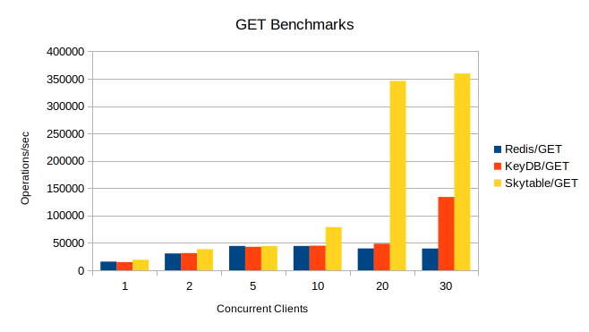
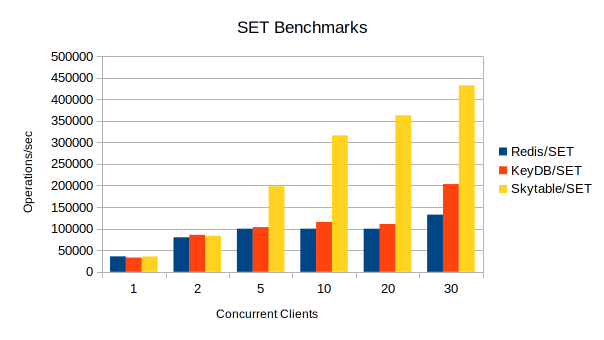

# Skytable v/s the rest

> More comprehensive and thorough benchmarks will be published soon. Please wait till then! **[Read the benchmark notes](#notes)**!

## Benchmark summary

This is **an early benchmark** of [Skytable](https://github.com/skytable/skytable), [Redis](https://github.com/redis/redis) and [KeyDB](https://github.com/EQ-Alpha/KeyDB). It might have some minimal _glitches_. The intention here is to see how fast each database is, out-of-the-box without any added customizations. Skytable uses multi-threaded I/O and so do Redis and KeyDB.

To summarize, this is what things look like:





(click to see an enlarged image)

Reading the graph:

- The x-axis shows the number of threads
- The y-axis shows the throughput (operations/sec)

> ## Notes
>
> 1: **Seeing the _weird throughput bump_?**  
> Yes, I'm aware of the issue, and I will try to fix the fluctuation issue in an upcoming release.
>
> 2: **The KeyDB benchmark is still experimental**
>
> 3: **No pipelining was used in any benchmark** (Skytable's pipeline queries are currently under development)
>
> 4: **Key/value sizes are different!**
>
> - **Redis uses 3 byte** k/v sizes
> - **Skytable uses 4 byte** k/v sizes
> - **KeyDB** uses an unspecified k/v size (memtier doesn't say much about it; I couldn't find any appropriate documentation)
>
> 5: **Average values were taken**

## Procedure

For running each benchmark:

1. The source code was downloaded and compiled (if required)
2. The machine was allowed to _cool down_ for exactly 1 hour after a reboot to try and reduce nondeterministic cases
3. The benchmark was run

Jump to:

- [Machine specs](#machine)
- [Redis benchmark procedure](#benchmarking-redis)
- [Skytable benchmark procedure](#benchmarking-skytable)
- [KeyDB benchmark procedure](#benchmarking-keydb)

## Machine

Output of `lscpu` (trimmed):

```
ubuntu@ip-172-31-13-51:~$ lscpu
Architecture:                    x86_64
CPU op-mode(s):                  32-bit, 64-bit
Byte Order:                      Little Endian
Address sizes:                   46 bits physical, 48 bits virtual
CPU(s):                          32
On-line CPU(s) list:             0-31
Thread(s) per core:              2
Core(s) per socket:              16
Socket(s):                       1
NUMA node(s):                    1
Vendor ID:                       GenuineIntel
CPU family:                      6
Model:                           85
Model name:                      Intel(R) Xeon(R) Platinum 8259CL CPU @ 2.50GHz
Stepping:                        7
CPU MHz:                         3189.320
BogoMIPS:                        5000.00
Hypervisor vendor:               KVM
Virtualization type:             full
L1d cache:                       512 KiB
L1i cache:                       512 KiB
L2 cache:                        16 MiB
L3 cache:                        35.8 MiB
```

Output of `uname -a`:

```
Linux ip-172-31-13-51 5.8.0-1042-aws #44~20.04.1-Ubuntu SMP Mon Aug 2 11:25:34 UTC 2021 x86_64 x86_64 x86_64 GNU/Linux
```

Output of `cat /proc/meminfo | grep MemTotal`:

```
MemTotal:       130415620 kB
```

Output of `lsb_release -a`:

```
No LSB modules are available.
Distributor ID:	Ubuntu
Description:	Ubuntu 20.04.2 LTS
Release:	20.04
Codename:	focal
```

**Summary**
So we have a 16-Core VM (32 threads due to hyperthreading) running Ubuntu 20.04.2 with 130.4GB RAM.

## Benchmarking Redis

### Installing Redis

```sh
wget https://download.redis.io/releases/redis-6.2.5.tar.gz
tar -xf redis-6.2.5.tar.gz
cd redis-6.2.5 && sudo make install
```

Now that Redis is installed, let's benchmark `GET` and `SET` in Redis. First start the server (simply `redis-server --io-threads 16 &` to run it in the background). We'll pass `--csv` to avoid too much output and only show the
required section of output.

### Benchmarking Redis

**Bench 1: 1 clients, 1 thread**

```sh
redis-benchmark -t set,get -n 100000 -c 1 --threads 1 --csv
```

Output:

```
"SET","35778.18"
"GET","35919.54"
```

**Bench 2: 2 clients, 2 threads**

```sh
redis-benchmark -t set,get -n 100000 -c 2 --threads 2 --csv
```

Output:

```
"SET","79936.05"
"GET","79936.05"
```

**Bench 3: 5 clients, 5 threads**

```sh
redis-benchmark -t set,get -n 100000 -c 5 --threads 5 --csv
```

Output:

```
"SET","99900.09"
"GET","99900.09"
```

**Bench 4: 10 clients, 10 threads**

```sh
redis-benchmark -t set,get -n 100000 -c 10 --threads 10 --csv
```

Output:

```
"SET","99900.09"
"GET","99900.09"
```

**Bench 5: 20 clients, 20 threads**

```sh
redis-benchmark -t set,get -n 100000 -c 20 --threads 20 --csv
```

Output:

```
"SET","99800.40"
"GET","99800.09"
```

**Bench 6: 30 clients, 30 threads**

```sh
redis-benchmark -t set,get -n 100000 -c 30 --threads 30 --csv
```

Output:

```
"SET","132450.33"
"GET","131926.12"
```

## Benchmarking Skytable

We'll use the latest stable Skytable version off `next` (commit a1ea9c31114)

### Installing Skytable

Skytable comes with pre-built binaries by default, unlike Redis that requires you to manually build the binaries. However, as we're benchmarking off the latest commit, we'll need to build it.

```sh
cargo build --release && cd target/release/skytable
```

### Benchmarking Skytable

To start Skytable, we'll simply run `./skyd &` to keep it in the background. Like the other benchmark, we'll trim output to only keep what's necessary. Also the number of threads for the benchmark in Skytable is determined by the number of clients, so we don't have to explicitly specify the number of threads.

**Bench 1: 1 client, 1 thread**

```sh
sky-bench -c1 -q100000 --json
```

Output:

```json
[
  { "report": "GET", "stat": 35819.636414 },
  { "report": "SET", "stat": 35524.728037 }
]
```

**Bench 2: 2 clients, 2 threads**

```sh
sky-bench -c2 -q100000 --json
```

Output:

```json
[
  { "report": "GET", "stat": 82489.2301145 },
  { "report": "SET", "stat": 83473.0270512 }
]
```

**Bench 3: 5 clients, 5 threads**

```sh
sky-bench -c5 -q100000 --json
```

Output:

```json
[
  { "report": "GET", "stat": 200557.406392 },
  { "report": "SET", "stat": 198217.313562 }
]
```

**Bench 4: 10 clients, 10 threads**

```sh
sky-bench -c10 -q100000 --json
```

Output:

```json
[
  { "report": "GET", "stat": 318038.853356 },
  { "report": "SET", "stat": 316238.431393 }
]
```

**Bench 5: 20 clients, 20 threads**

```sh
sky-bench -c20 -q100000 --json
```

Output:

```json
[
  { "report": "GET", "stat": 361300.582958 },
  { "report": "SET", "stat": 362723.490174 }
]
```

**Bench 6: 30 clients, 30 threads**

```sh
sky-bench -c30 -q100000 --json
```

Output:

```json
[
  { "report": "GET", "stat": 446146.100598 },
  { "report": "SET", "stat": 432186.17602 }
]
```

## Benchmarking KeyDB

Please note that the KeyDB benchmark is **still experimental**.

### Installing KeyDB

We'll download and install the latest KeyDB release at this time from [this link](https://github.com/EQ-Alpha/KeyDB/releases/tag/v6.2.0).

```sh
wget https://github.com/EQ-Alpha/KeyDB/archive/refs/tags/v6.2.0.zip
unzip v6.2.0.zip
cd KeyDB-6.2.0 && sudo make install
```

We'll start KeyDB by running: `keydb-server --server-threads 16 &`, explicitly telling the server
to use 16 threads (since we have 16 vCPUs, and
`keydb-server` won't allow us to pass 32).

Do note that KeyDB requires a number of libraries that need to be installed (the package names are for Ubuntu):

- libcurl4-openssl-dev
- uuid-dev

### Installing Memtier

[As recommended in the documentation](https://docs.keydb.dev/docs/benchmarking/), we will use the
[memtier benchmark tool](https://github.com/RedisLabs/memtier_benchmark) from Redis Labs to benchmark KeyDB.

```sh
sudo apt-get install build-essential autoconf automake libpcre3-dev libevent-dev pkg-config zlib1g-dev
git clone https://github.com/RedisLabs/memtier_benchmark.git
cd memtier_benchmark
autoreconf -ivf
./configure
sudo make install
```

For memtier, we have to specify the ratio of sets:gets. We will do them individually to get the best numbers.
So we do `0:1` when we want all GETs and `1:0` when we want all sets.
Also `-c1` means one client per thread (similar to `sky-bench`). We'll also use the defaults to get the highest benchmarks.

### Benchmarking KeyDB

**Bench 1: 1 thread/1 client**

```sh
memtier_benchmark --ratio=0:1 -c1 -t1
memtier_benchmark --ratio=1:0 -c1 -t1
```

Output:

```
Gets: 33873
Sets: 33004
```

**Bench 2: 2 threads/2 clients**

```sh
memtier_benchmark --ratio=0:1 -c1 -t2
memtier_benchmark --ratio=1:0 -c1 -t2
```

Output:

```
Gets: 86279
Sets: 85667
```

**Bench 3: 5 threads/5 clients**

```sh
memtier_benchmark --ratio=0:1 -c1 -t5
memtier_benchmark --ratio=1:0 -c1 -t5
```

Output:

```
Gets: 105218
Sets: 103589
```

**Bench 4: 10 threads/10 clients**

```sh
memtier_benchmark --ratio=0:1 -c1 -t10
memtier_benchmark --ratio=1:0 -c1 -t10
```

Output:

```
Gets: 116394
Sets: 115647
```

**Bench 5: 20 threads/20 clients**

```sh
memtier_benchmark --ratio=0:1 -c1 -t20
memtier_benchmark --ratio=1:0 -c1 -t20
```

Output:

```
Gets: 113154
Sets: 110729
```

**Bench 6: 30 threads/30 clients**

```sh
memtier_benchmark --ratio=0:1 -c1 -t30
memtier_benchmark --ratio=1:0 -c1 -t30
```

Output:

```
Gets: 196542
Sets: 203297
```

## Contributing

Ofcourse! If you find errors or possible sources of error
in any of the benchmarks, please consider opening an issue.

## License

Distributed under the [MIT License](./LICENSE).
