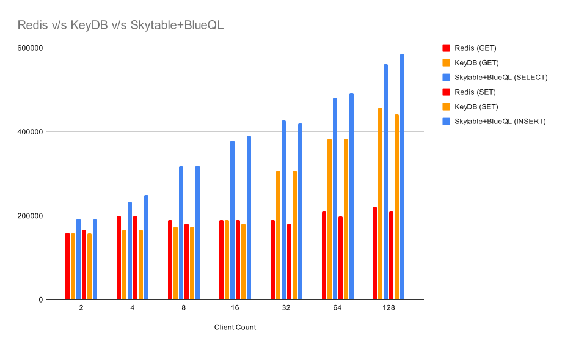

# Skytable Benchmarks

The goal here is to see how [Skytable](https://github.com/skytable/skytable), which is primarily in-memory but instead of simple commands uses an actual query language (BlueQL) stacks up against in-memory key/value stores like Redis (which is inherently single threaded except for I/O threads) and KeyDB (which is multi-threaded).

> ### IMPORTANT NOTE: Skytable has an actual query language BlueQL while others don't. This means Skytable does way more work than the key/value stores which use commands!

## Results

### Results conclusion

**Even with a complete query language, Skytable is as fast, or faster** than popular key/value stores (which use simple commands and do not have a query language).

**Legend**:
- Redis is red
- KeyDB is orange
- Skytable is blue

## Notes

> **Future planned benchmarks**:
> - Dragonfly
> - Aerospike
> - MongoDB
> - ArangoDB
>
> **Future planned implementation**:
> - Automated benches and report generation
> - Benchmark matrix so that you can benchmark one database against another, as you choose! Compatible commands/queries would be automatically generated
>
> **Future planned VM benches**:
> - Bench against multiple AWS+GCP+Azure VM types
> - Bench across x86_64 and ARM64

## Benchmark setup

- **Here's what we'll do:**
  - We'll start up each server with the ability to use multi-threads (or io-threads) and set this to the number of available logical CPU cores (for example a processor might have 6 cores but with HT can run 12 threads so we go with 12)
  - For each CRD operation, we'll run 1,000,000 queries for a total of 4M queries.
    > **Why not `UPDATE`s?** Unfortunately, there's no SQL equivalent of an `UPDATE` in Redis/KeyDB. So, we skip it for now.
  - We'll run a CRUD sequence:
    - For simple key/value stores:
      - `SET <7 digit key> <1 byte value>`
      - `GET <7 digit key>`
      - `DEL <7 digit key>`
    - For Skytable:
      - `INSERT INTO mymodel(<7 digit key>, <1 byte value>)`
      - `SELECT pw FROM mymodel WHERE un = <7 digit key>`
      - `DELETE FROM mymodel WHERE un = <7 digit key>`
- **Benchmark machine**:
  - The benchmarking machine has:
    - a 6C/12T configuration
    - 32GB RAM
    - Base clock: 2.7Ghz, Turbo: 4.5 Ghz
    - Arch: Intel x86_64 (manufacturer is also Intel)
    - Tiger Lake CPU (11th Generation)
  - **OS**:
    - Ubuntu 22.04
    - Kernel: 5.19.0-42-generic
    - Governor: `performance` (checking `cat /sys/devices/system/cpu/cpu0/cpufreq/scaling_governor`)
  - **Database versions**:
    - Skytable v0.8.0-beta
    - Redis `master` (991aff1)
    - KeyDB `master` (674d9fb)

## How the benchmarks were run

- Skytable:
  - Server started with `skyd <rootpass>`
  - Benchmark tool run with varying values for `<connections>`: `sky-bench --password <rootpass> --connections <connections>`
- Redis and KeyDB:
  - Server started with `redis-server --io-threads=12` and `keydb-server --io-threads=12`
  - Benchmark tool run for different tests (`-t` each for `get` and `set`) like this: `redis-benchmark --threads 12 -n 1000000 -d 7 -t <testname> -c <connections>`

## License

This project is distributed under the [MIT License](/LICENSE).